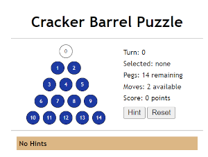

# barrel-puzzle

A simple puzzle game built with [React](https://reactjs.org/) and [Vite](https://vitejs.dev/), based on the Cracker Barrel puzzle.



## Try It

[https://gianni.org/cracker](https://gianni.org/cracker)

## Build It

Use [npm](https://www.npmjs.com/) to install dependencies and run the development server:

```bash
npm install
npm run dev
```

Using [npm](https://www.npmjs.com/) to install dependencies and build the production server (*based on the / base path*):

```bash
npm install
npm run build
```

The application can also be deployed to a web host through SSH using
[npm](https://www.npmjs.com/) (*using /cracker as the base path*):

```bash
npm install
npm run deploy
```

There is also a `lint` and `preview` scripts available.
